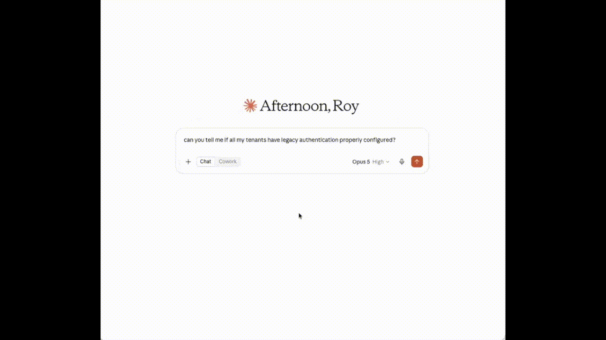

# InforcerCommunity MCP

Ask your AI assistant questions about your [Inforcer](https://inforcer.com) tenants, in plain
English, and get real answers back.

> *"Which of my tenants are furthest from their baseline?"*
> *"In Contoso, which policy controls password expiry?"*
> *"Who was given Global Administrator last month?"*

Your assistant normally can't see your Inforcer data. This connects the two.

**In any language.** Ask in Dutch and the answer comes back in Dutch. What this sends your assistant
is data rather than finished sentences, so the wording is always your assistant's - and it speaks
nearly everything.

> **Community project. Not owned, endorsed, or maintained by Inforcer.**
> Built by [Roy Klooster](https://github.com/royklo). Bugs here are mine, not theirs.

## Start here

| | |
|---|---|
| **[Set it up](docs/SETUP.md)** | Getting it working, and what to do if it doesn't |
| **[Examples](docs/EXAMPLES.md)** | What you can ask, and what comes back |
| **[Security](docs/SECURITY.md)** | Where your clients' data goes |

## What you need

- **An assistant that runs on your own computer** - Claude Desktop, Claude Code, VS Code, Cursor,
  Windsurf or Codex.
- **An Inforcer API key.** Ask your Inforcer administrator, or Inforcer support, for one.
- **Your region** - `uk`, `eu`, `us` or `anz`. Whoever gave you the key knows which.
- **Node.js 20 or newer** - free, from [nodejs.org](https://nodejs.org), the button marked **LTS**.
  Your assistant needs it to start this tool. Nothing else to download.

**Claude in a web browser cannot do this**, and neither can Microsoft 365 Copilot or ChatGPT. They
run on someone else's computer, so they cannot start a tool on yours.

## Quickest way in

If you use **VS Code**, it is one click. It asks for your key and region the first time it runs.

| Platform | |
|---|---|
| macOS & Linux | [](https://insiders.vscode.dev/redirect/mcp/install?name=inforcer&inputs=%5B%7B%22type%22%3A%22promptString%22%2C%22id%22%3A%22inforcer-api-key%22%2C%22description%22%3A%22Inforcer%20API%20key%22%2C%22password%22%3Atrue%7D%2C%7B%22type%22%3A%22promptString%22%2C%22id%22%3A%22inforcer-region%22%2C%22description%22%3A%22Inforcer%20region%3A%20uk%2C%20eu%2C%20us%20or%20anz%22%2C%22default%22%3A%22uk%22%7D%5D&config=%7B%22type%22%3A%22stdio%22%2C%22command%22%3A%22npx%22%2C%22args%22%3A%5B%22-y%22%2C%22inforcercommunity-mcp%40latest%22%5D%2C%22env%22%3A%7B%22INFORCER_API_KEY%22%3A%22%24%7Binput%3Ainforcer-api-key%7D%22%2C%22INFORCER_REGION%22%3A%22%24%7Binput%3Ainforcer-region%7D%22%7D%7D) |
| Windows | [](https://insiders.vscode.dev/redirect/mcp/install?name=inforcer&inputs=%5B%7B%22type%22%3A%22promptString%22%2C%22id%22%3A%22inforcer-api-key%22%2C%22description%22%3A%22Inforcer%20API%20key%22%2C%22password%22%3Atrue%7D%2C%7B%22type%22%3A%22promptString%22%2C%22id%22%3A%22inforcer-region%22%2C%22description%22%3A%22Inforcer%20region%3A%20uk%2C%20eu%2C%20us%20or%20anz%22%2C%22default%22%3A%22uk%22%7D%5D&config=%7B%22type%22%3A%22stdio%22%2C%22command%22%3A%22cmd%22%2C%22args%22%3A%5B%22%2Fc%22%2C%22npx%22%2C%22-y%22%2C%22inforcercommunity-mcp%40latest%22%5D%2C%22env%22%3A%7B%22INFORCER_API_KEY%22%3A%22%24%7Binput%3Ainforcer-api-key%7D%22%2C%22INFORCER_REGION%22%3A%22%24%7Binput%3Ainforcer-region%7D%22%7D%7D) |

Any other assistant: **[Set it up](docs/SETUP.md)**.

Need a whole tenant documented as a file? The
[InforcerCommunity PowerShell module](https://github.com/royklo/InforcerCommunity) does that, and
does it better.
